<div align="center">

<h1>
  
</h1>

---

<table align="center">
<tr>
<td>

```diff
! 🚨 THE MISINFORMATION PANDEMIC 🚨
```

</td>
<td>

```diff
+ 🛡️ OUR AI-POWERED SOLUTION 🛡️
```

</td>
</tr>
</table>

</div>

<br>

<div align="center">



</div>

<br>

```mermaid
mindmap
  root((🛡️ SatyaShield))
    🌐 Web Platform
      📊 Dashboard
      🔍 Analysis
      📈 Reports
    🧩 Extension
      ⚡ Real-time
      🖱️ One-click
      🚀 Instant
    📱 WhatsApp
      💬 Chat Bot
      🤖 AI Assistant
      📲 Mobile Access
    🔧 Backend
      🧠 AI Engine
      ☁️ Cloud Power
      ⚖️ Verification
```

## 🌊 **The Information Tsunami**

<details>
<summary>🌍 <strong>Click to See the Crisis in Numbers</strong></summary>

<br>

<div align="center">

```ascii
    🌊 MISINFORMATION FLOOD 🌊
    
    ╭─────────────────────────────╮
    │  📈 6x FASTER THAN TRUTH   │
    │  💥 73% BELIEVE FAKE NEWS  │
    │  🔥 2.4B PEOPLE AFFECTED   │
    │  💰 $1.2T ECONOMIC DAMAGE  │
    ╰─────────────────────────────╯
```

</div>

**🇮🇳 India Specific Crisis:**
- 📱 **WhatsApp Forwards**: 89% don't verify before sharing
- 🗳️ **Election Period**: 300% spike in political misinformation  
- 🏥 **Health Scares**: 67% medical misinformation goes viral
- 💸 **Financial Frauds**: ₹1,200 crore lost annually

</details>

<br>

## ⚡ **SatyaShield: The Truth Revolution**

<div align="center">

```
🔮 ════════════════════════════════════════════════════════════ 🔮
                  ✨ ENTER THE MATRIX OF TRUTH ✨
🔮 ════════════════════════════════════════════════════════════ 🔮
```

</div>

<div align="center">
<table>
<tr>
<td width="25%" align="center">
<br><strong>🔍 EXTRACT</strong>
<br><em>Claims Detection</em>
</td>
<td width="25%" align="center">
<br><strong>🧠 ANALYZE</strong>
<br><em>Evidence Gathering</em>
</td>
<td width="25%" align="center">
<br><strong>⚖️ VERIFY</strong>
<br><em>Truth Assessment</em>
</td>
<td width="25%" align="center">
<br><strong>🎓 EDUCATE</strong>
<br><em>Digital Literacy</em>
</td>
</tr>
</table>
</div>

<br>

<div align="center">

### 🎯 **AI SUPERPOWERS UNLEASHED**

```
┌─ 🤖 NEURAL CLAIM EXTRACTION ─┐  ┌─ 🌐 PARALLEL EVIDENCE MINING ─┐  ┌─ 🎭 MANIPULATION DETECTION ─┐
│                              │  │                               │  │                            │
│  • Multi-language Support    │  │  • 50+ Authoritative Sources │  │  • Emotional Triggers      │
│  • Context Understanding     │  │  • Real-time Fact Checking   │  │  • Statistical Deception   │
│  • Bias Detection           │  │  • Source Credibility Scores │  │  • Visual Manipulation     │
│  • Sentiment Analysis       │  │  • Historical Verification   │  │  • Echo Chamber Tactics    │
│                              │  │                               │  │                            │
└──────────────────────────────┘  └───────────────────────────────┘  └────────────────────────────┘
```

</div>

<br>

## 🚀 **Platform Universe**

```mermaid
graph TB
    A[🌟 User] --> B{📱 Choose Platform}
    
    B -->|🌐 Deep Analysis| C[💻 Web Platform]
    B -->|⚡ Quick Check| D[🧩 Browser Extension] 
    B -->|📱 Mobile Access| E[💬 WhatsApp Bot]
    B -->|🔧 Integration| F[🛠️ Developer API]
    
    C --> G[📊 Comprehensive Dashboard]
    D --> H[🚀 Instant Verification]
    E --> I[🤖 Conversational AI]
    F --> J[🔌 Custom Integration]
    
    G --> K[🎓 Educational Hub]
    H --> K
    I --> K
    J --> K
    
    K --> L[🧠 Smarter Digital Citizens]
    
    style A fill:#ff6b6b,stroke:#d63031,stroke-width:3px,color:#fff
    style L fill:#00b894,stroke:#00a085,stroke-width:3px,color:#fff
    style K fill:#6c5ce7,stroke:#5f39e0,stroke-width:2px,color:#fff
```

<div align="center">



</div>

<table align="center">
<tr>
<td colspan="4" align="center">

### 🎨 **CREATIVE REPOSITORY CARDS**

</td>
</tr>
<tr>
<td width="25%">

```yaml
🔧 Backend Engine
├── 🧠 Gemini-2.5-Pro LLM
├── ☁️ Google Fact Check API
├── 🔍 Evidence Mining
├── ⚡ Real-time API (tavily)
└── 🛡️ Confidence scoring Algorithms
```

[](https://github.com/Satya-Shield/Backend)

</td>
<td width="25%">

```yaml
🌐 Web Platform
├── ⚛️ React Dashboard
├── 🎨 Modern UI/UX
├── 📊 Data Visualization
├── 🔒 Secure Portal
└── 📱 Responsive Design
```

[](https://github.com/Satya-Shield/Frontend)

</td>
<td width="25%">

```yaml
🧩 Browser Extension
├── 🚀 Chrome Integration
├── ⚡ Instant Verification
├── 🎯 Context Aware
├── 🌍 Universal Support
└── 🔥 Zero Friction
```

[](https://github.com/Satya-Shield/Browser-Extension)

</td>
<td width="25%">

```yaml
📱 WhatsApp Bot
├── 🤖 Conversational AI
├── 💬 Natural Language
├── 📲 Mobile First
├── 🌏 Global Reach
└── 🔊 Voice of Truth
```

[](https://github.com/Satya-Shield/Whatsapp-Bot)

</td>
</tr>
</table>

<br>

## 🔥 **DEMONSTRATION THEATER**

<div align="center">

### 🎬 **LIVE ACTION SCENARIOS**

</div>

<table>
<tr>
<td width="50%">

### 🎭 **SCENARIO 1: The Viral Hoax**

```diff
📱 User receives WhatsApp forward:
- "🚨 URGENT: New COVID variant spreads through WiFi signals! 
-  Turn off your router immediately! Share to save lives!"

🛡️ SatyaShield Response:
+ ❌ MISINFORMATION DETECTED
+ 📊 Confidence: 95% (Extremely False)
+ 🎭 Techniques: Fear Mongering, Scientific Impossibility
+ 📚 Explanation: "Viruses cannot spread through electromagnetic waves"
+ 🔗 Sources: WHO, CDC, IEEE Scientific Papers
```

</td>
<td width="50%">

### 🎯 **SCENARIO 2: The Investment Trap**

```diff
🌐 User encounters Facebook post:
- "💰 This ONE cryptocurrency will make you RICH! 
-  My aunt invested ₹10,000 and bought a BMW!"

🛡️ SatyaShield Analysis:
+ ⚠️ POTENTIAL SCAM DETECTED
+ 📊 Confidence: 85% (Likely Fraudulent)
+ 🎭 Techniques: Testimonial Manipulation, FOMO Tactics
+ 💡 Red Flags: Unrealistic returns, Emotional appeals
+ 🔐 Protection: Investment verification guidelines
```

</td>
</tr>
</table>

<br>

## 🎮 **QUICK START ADVENTURE**

<div align="center">

### 🚀 **CHOOSE YOUR QUEST**

</div>

<table>
<tr>
<td width="33%" align="center">

```
🌐 WEB EXPLORER
┌─────────────────┐
│  1. Visit Site  │
│  2. Paste Content│
│  3. Get Verdict │
│  4. Learn Truth │
└─────────────────┘
```

[](https://satyashield.com)

</td>
<td width="33%" align="center">

```
📱 MOBILE WARRIOR
┌─────────────────┐
│  1. Open WhatsApp│
│  2. Text Bot    │
│  3. Send Query  │
│  4. Get Answer  │
└─────────────────┘
```

[](https://wa.me/15551482620)

</td>
<td width="33%" align="center">

```
🧩 BROWSER NINJA
┌─────────────────┐
│  1. Install Ext │
│  2. Select Text │
│  3. Click Verify│
│  4. See Results │
└─────────────────┘
```

[](https://chrome.google.com/webstore)

</td>
</tr>
</table>

<br>

<details>
<summary>👨‍💻 <strong>Developer Playground</strong></summary>

<br>

### 🔧 **FOR THE CODE WARRIORS**

```bash
# 🚀 CLONE THE ENTIRE UNIVERSE
git clone https://github.com/Satya-Shield/Backend.git
git clone https://github.com/Satya-Shield/Frontend.git  
git clone https://github.com/Satya-Shield/Browser-Extension.git
git clone https://github.com/Satya-Shield/Whatsapp-Bot.git

# 🎯 QUICK SETUP MAGIC
cd Backend && uv run run.py
cd Frontend && npm install && npm start
cd Browser-Extension && npm run build
cd Whatsapp-Bot && npm install && npm start
```

</details>

<br>

## 🌟 **COMMUNITY OF TRUTH WARRIORS**

<div align="center">

```
                         👥 JOIN THE RESISTANCE 👥
                                     
        🌟 Contributors        🛡️ Truth Defenders        🎓 Educators
      ┌─────────────────┐    ┌─────────────────┐    ┌─────────────────┐
      │                 │    │                 │    │                 │
      │  🔧 Code        │    │  🔍 Testing     │    │  📚 Content     │
      │  🎨 Design      │    │  🐛 Bug Reports │    │  🌍 Translation │
      │  📝 Docs        │    │  💡 Ideas       │    │  🎬 Videos      │
      │  🧪 Testing     │    │  📢 Advocacy    │    │  📖 Guides      │
      │                 │    │                 │    │                 │
      └─────────────────┘    └─────────────────┘    └─────────────────┘
              │                        │                        │
              └────────────────────────┼────────────────────────┘
                                       │
                               🏆 COLLECTIVE IMPACT
                          "Building Informed Digital Citizens"
```

</div>

<br>

## 🎨 **VISUAL IMPACT SHOWCASE**

<div align="center">

### 🌈 **BEFORE vs AFTER SATYASHIELD**

</div>
<div align="center">
<table>
<tr>
<td width="50%">

```diff
❌ BEFORE SATYASHIELD
─────────────────────

😰 User sees suspicious content
🤷 No way to verify quickly  
📱 Shares without thinking
🌊 Misinformation spreads
💥 Damage is done
🔄 Cycle repeats
```

</td>
<td width="50%">

```diff
✅ AFTER SATYASHIELD
───────────────────

😊 User encounters content
🛡️ SatyaShield instantly alerts
🎓 User learns why it's false
🛑 Sharing is stopped
📚 Knowledge is gained
🌟 Truth prevails
```

</td>
</tr>
</table>
</div>


```
